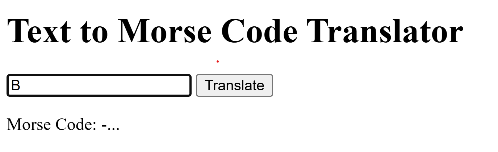

---

## 🔵 Overview

This project is a **simple Text to Morse Code Translator**.

It consists of:
- One text input
- One output displaying the translated Morse code

Nothing more.

There are **no animations**, **no colors**, and **no advanced UI logic**.
The goal of this project is purely educational and functional.

---

## 🖼️ Interface Preview

You can see how the application looks in the following image:

The interface is **basic and minimal**, focusing only on the translation result.

---

## 🚀 Features

- Text to Morse code translation
- Basic Flask backend
- Simple HTML template
- One input → one output

---

## 🧠 Project Structure

morse_app/
│── app.py
│── requirements.txt
│── morse.png
│── templates/
│── static/

---

## ⚙️ Technologies Used

- Python 3
- Flask
- HTML
- CSS (basic, no styling focus)

---

## ▶️ How to Run Locally

pip install -r requirements.txt  
python app.py  

Then open:  
http://127.0.0.1:5000

---

## ⚠️ Notes

- This is a basic learning project
- No frontend animations or styling
- Not intended for production use

---

## 🔵 Developed By

Andrés Fábregas  
Electronic Engineer · Software Developer

